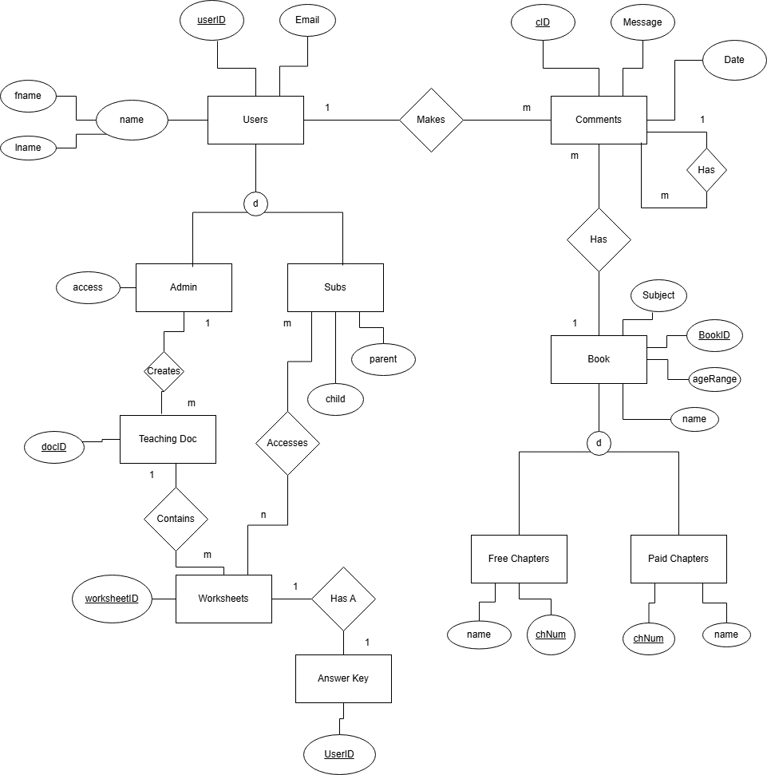
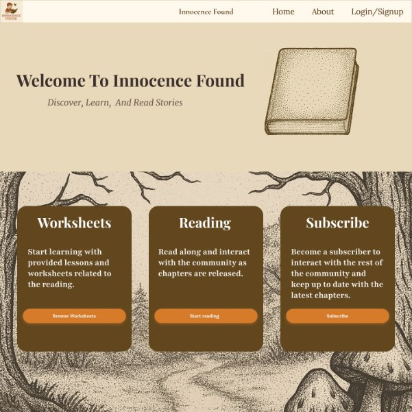
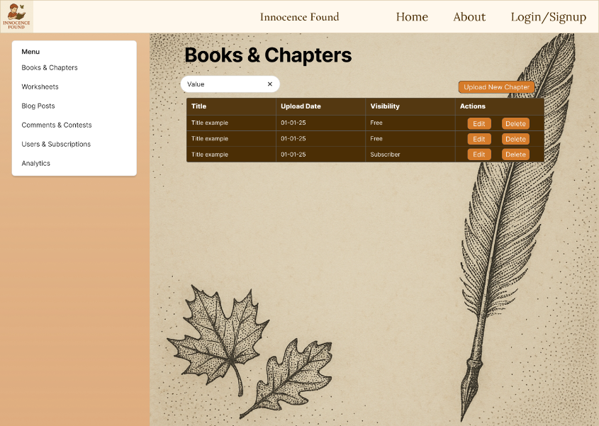
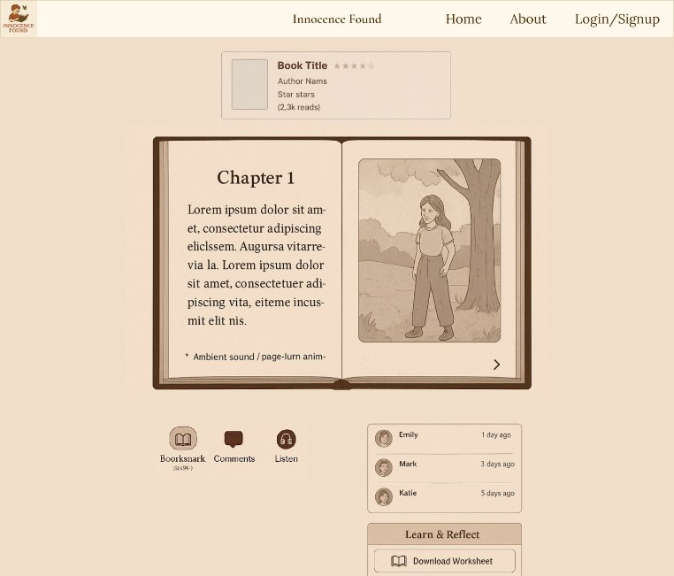
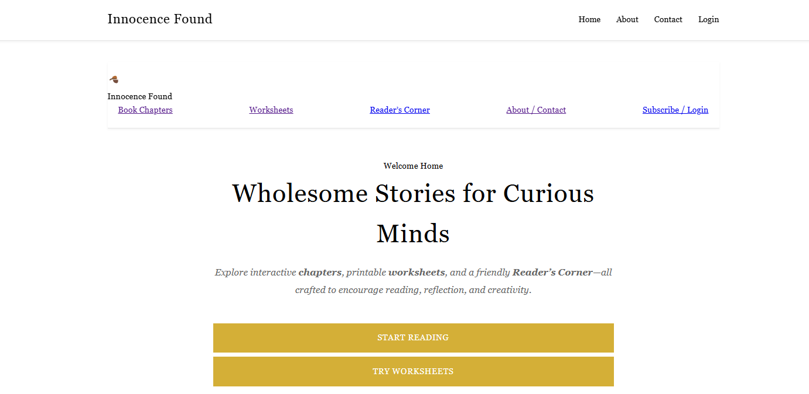
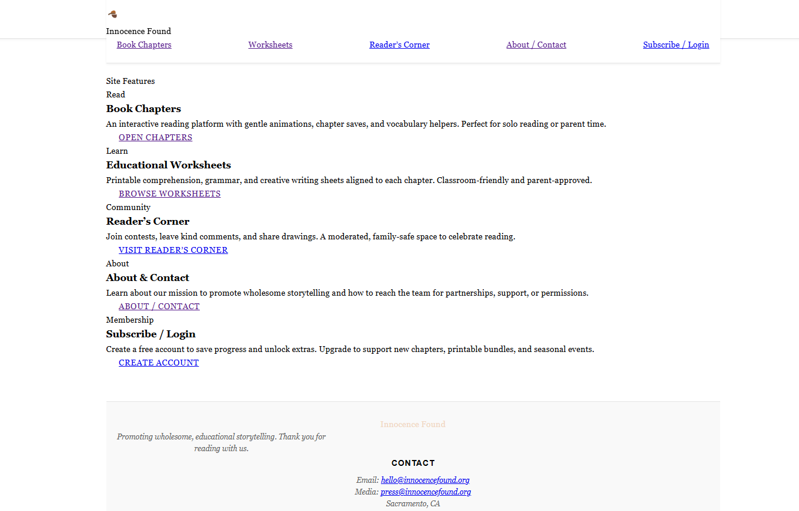

# Innocence Found  
*A storytelling and educational platform created for author Cynthia Davies.*

---

### Project Title & Logo
**Innocence Found** is a storytelling platform designed for families, children, and educators.

  

The logo represents the warm, family-focused nature of the project—emphasizing reading, imagination, and learning.

---

### Synopsis / Overview
Innocence Found is an online platform where author **Cynthia Davies** can share her original stories, worksheets, audio content, and blog posts.  
It provides a **safe, simple, and engaging experience** for readers, parents, and educators.

The platform solves the challenge of offering:
- Wholesome, structured storytelling
- Guided self-reflection through advice questions
- Secure access to premium worksheets and answer keys
- Author–reader interaction in a controlled environment
- A manageable CMS for chapter uploads, audio, and worksheets

---

## Features

### Interactive Reading Viewer
- Clear chapter layout with smooth navigation  
- Per-chapter advice/reflection questions
- Comment section for user engagement
- Subscriber-only **audio playback**

### Worksheets & Gated Answer Keys
- Printable worksheets for guided learning 
- Answer keys only accessible to parents

### Subscription & Access Control
- Secure login and role-based permissions  
- Paywall lock/unlock logic  
- Parent/subscriber verification  

### Admin Dashboard
- Manage chapters, audio, worksheets
- Update and manage users
- Moderate comments and content submissions
- Analyze user traffic and activity on the website
  

---

## Tech Stack

**Frontend:**  
- HTML  
- CSS  
- JavaScript  

**Backend / Services:**  
- Supabase (Auth, Database, Storage)

**Hosting:**  
- Vercel  

**Tools:**  
- VSCode  
- GitHub  
- Jira  
- Figma  

---

## ERD / System Architecture

---

## Developer Instructions *(CSC 191 Placeholder)*

---

## Testing *(CSC 191 Placeholder)* 

---

## Deployment *(CSC 191 Placeholder)*

---

## Timeline / Milestones

### **Sprint 5: Core Reading System**
- Book reader prototype  
- Chapter uploading (admin)  
- Page-turn animation  
- Comment system  

### **Sprint 6: Subscription System**
- Auth + user roles  
- Paywall lock/unlock logic  
- Parent verification system  

### **Sprint 7: Worksheets System**
- Upload & download  
- Answer key gating  
- PDF viewer / print flow  

### **Sprint 8: Admin Dashboard**
- CMS controls  
- Comment moderation  
- Contest module  

### **Sprint 9: Polishing & UAT**
- Bug fixes  
- Feedback integration  
- Client review & adjustments  

---

## Screenshots / Prototypes

### Figma Design

#### Homepage

#### Admin Dashboard

#### Chapter Reader

## Prototype
#### Homepage Title and Content

## Team Members

| Name | Role | Email |
|------|------|--------|
| **David McGlasson** | Team Leader/Developer | mcglasson@csus.edu |
| **Iftekhar Ahmad** | Developer | iahmad@csus.edu |
| **Mandee Jauregui** | Developer | mandeejauregu@csus.edu |
| **Mohammad Mustafa Shams** | Developer | mshams@csus.edu |
| **Nisha Joshi** | Developer | nishajoshi@csus.edu |
| **Suyesh Shrestha** | Developer | sshrestha3@csus.edu |
| **Wilson Luong** | Developer | wluong@csus.edu |
| **Samir Saqib** | Developer | samirsaqib@csus.edu |

---

## Client Information

**Cynthia Davies — Author and Educator**

Innocence Found is a developing digital storytelling platform designed to guide young readers through meaningful and reflective stories.

The platform encourages:
- **Self-reflection**  
- **Dialogue**  
- **Emotional awareness**  
- **Community engagement**

The long-term goal is to provide a space where readers can learn, reflect, and participate in a supportive storytelling experience.

