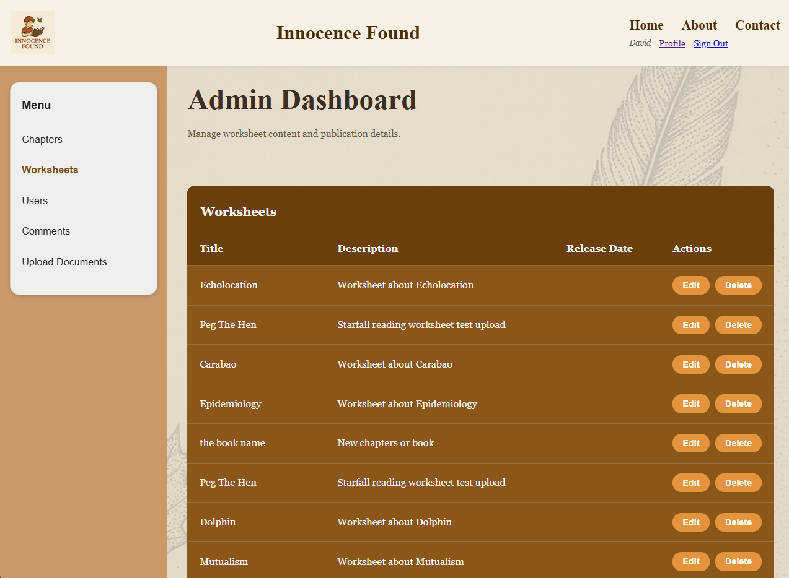
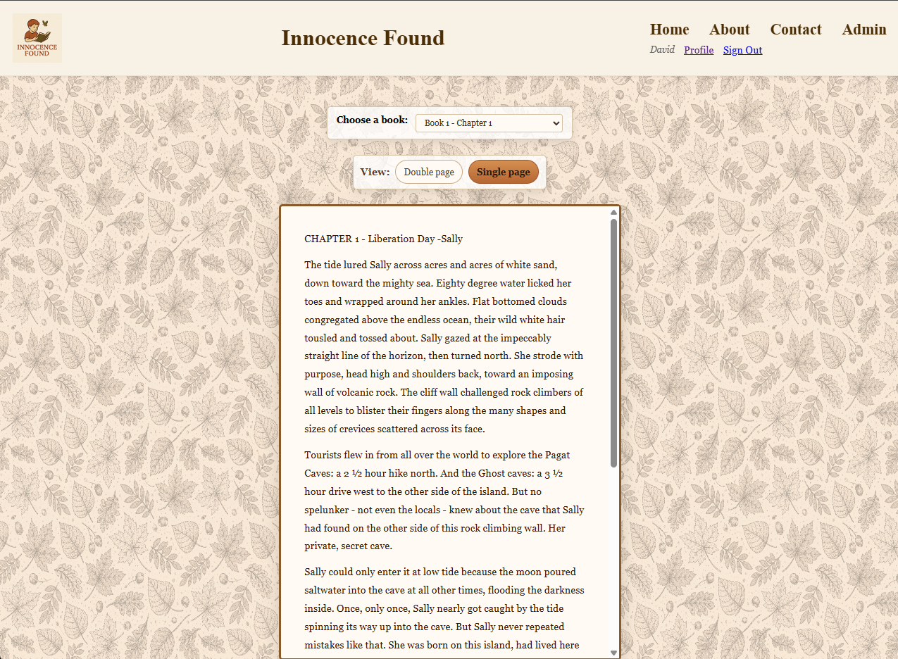
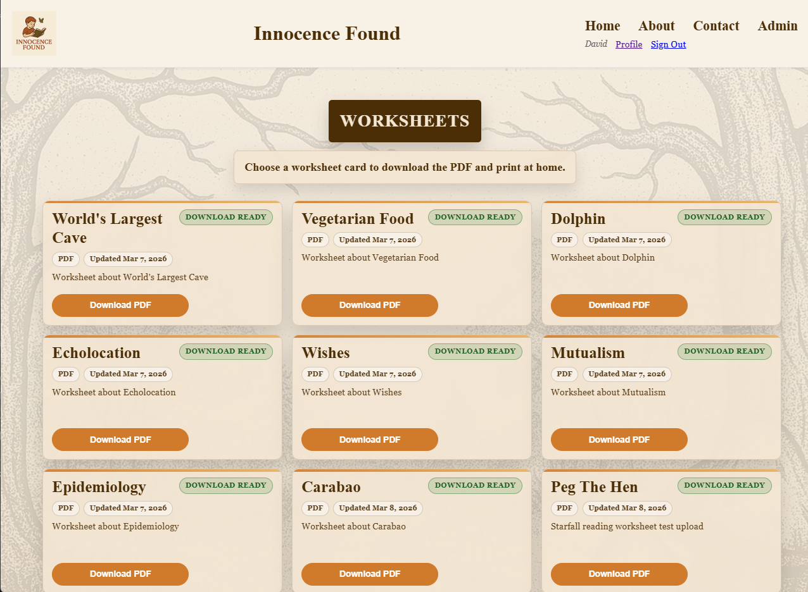

# Innocence Found


Innocence Found is a family-focused storytelling and educational web application created for author Cynthia Davies. It provides an inviting, kid-friendly reading experience with per-chapter reflection questions, author–reader interaction, printable worksheets, and subscription-based access to premium content.

## What this project does

- Hosts stories and chapters with a light, accessible reader UI.
- Provides per-chapter advice/reflection questions and a comment system.
- Offers printable worksheets and gated chapters for subscribers.
- Implements role-based access (free, subscriber, admin) and a subscription paywall for premium content.
- Ships an admin dashboard to upload/manage chapters, audio, worksheets, and moderate content.

## Why this was created

The app was built to give families and educators a safe, structured place to read original stories, guide reflection, and provide teaching materials that support discussion and learning, all while providing a family safe environment.

## Screenshots

### Homepage


Main landing page showing featured stories, navigation, and the overall look and feel of the application.

### Admin Dashboard


Tools for managing content, users, and moderating comments from the admin CMS.

### Chapter Reader


The reading interface with chapter navigation, reflection questions, and comment interaction.

### Printable Worksheet


Downloadable and printable materials that support chapter learning and guided activities.

## Tech Stack

- Frontend: HTML, CSS, JavaScript
- Backend / Services: Supabase (Auth, Database, Storage), Stripe (Payments)
- Hosting / Deployment: Vercel

## Download, Setup, Run, and Deploy

1. Download the repository:

```bash
git clone https://github.com/dmcglasson/Innocence-Found.git
cd Innocence-Found
```

2. Set up the project dependencies:

```bash
npm install
```

3. Run the site locally (static files). Options:

- Quick via Python 3 built-in server:

```bash
python -m http.server 8000
# then open http://localhost:8000
```

4. Deploy and configure environment variables: Contact the project lead for Supabase keys. When deploying, add them to `env.js` or the hosting provider's environment settings per `env-loader.js`.

## Testing

The project uses Jest, and all test files live in the `tests/` folder.

1. Install the dev dependencies:

```bash
npm install
```

2. Run the full test suite in serial mode:

```bash
npm run test:serial
```

3. Run the suite with coverage output when you need a test report:

```bash
npm run test:coverage
```

Test notes:
- The Jest config is set to use `jsdom` and automatically picks up `*.test.js` and `*.test.mjs` files inside `tests/`.
- Common coverage areas include the book reader, comments, auth flows, validators, and utility helpers.

## Deployment

This project is a static frontend app with `index.html` as the entry point, shared UI assets in `screens/`, `frontend/`, `js/`, and `styles.css`. Backend features are handled by Supabase and Stripe.

Recommended deployment flow:

1. Deploy the static frontend to a host such as Vercel.
2. Provide the public runtime values used by the browser app, including `SUPABASE_URL`, `SUPABASE_ANON_KEY`, and `SUPABASE_WORKSHEETS_BUCKET`.
3. Make sure `env.js` or your hosting platform’s environment setup supplies those public values before the app loads.
4. Deploy the Supabase Edge Functions in `supabase/functions/` so features like checkout, uploads, worksheet downloads, and author question voting are available.
5. Configure the Stripe webhook function (`stripe-webhook`) and any required Supabase secrets before turning on payments.
6. Verify the storage bucket for worksheets and chapters exists and that the public client keys can access the expected data.

For local testing, the same structure can be served as static files from `index.html` with a simple local server.

## Contributors

| Name | Role | Contact |
|------|------|---------|
| David McGlasson | Team Lead / Developer | mcglasson@csus.edu |
| Iftekhar Ahmad | Developer | iahmad@csus.edu |
| Mandee Jauregui | Developer | mandeejauregu@csus.edu |
| Mohammad Mustafa Shams | Developer | mshams@csus.edu |
| Nisha Joshi | Developer | nishajoshi@csus.edu |
| Suyesh Shrestha | Developer | sshrestha3@csus.edu |
| Wilson Luong | Developer | wluong@csus.edu |
| Samir Saqib | Developer | samirsaqib@csus.edu |


## Client

**Cynthia Davies** — Author and Educator. Innocence Found aims to support children, families, and educators with wholesome storytelling and guided learning materials.

---

For more developer details, see the `js/`, `modules/`, and `tests/` folders in the repository.
